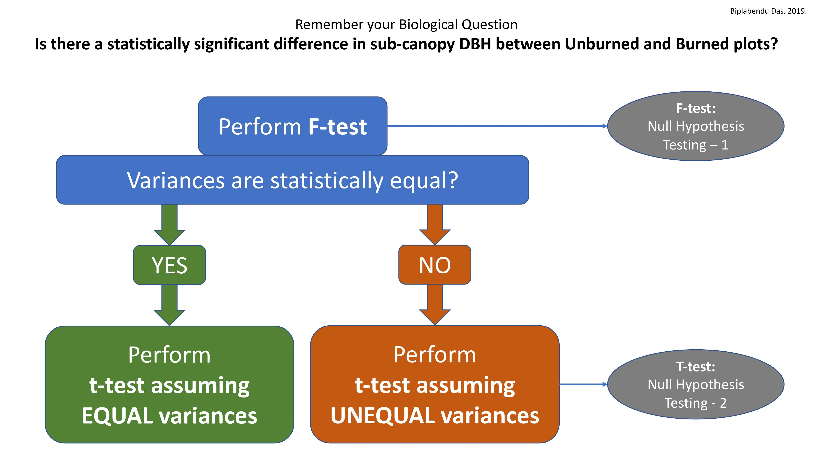
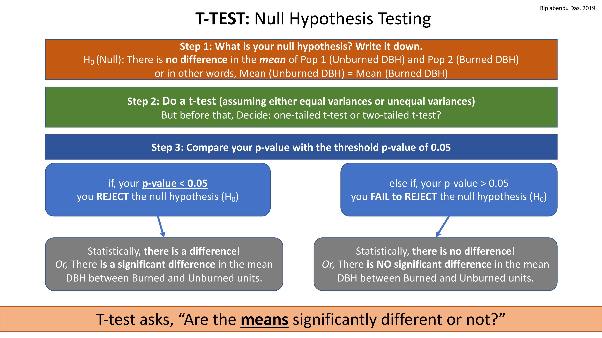
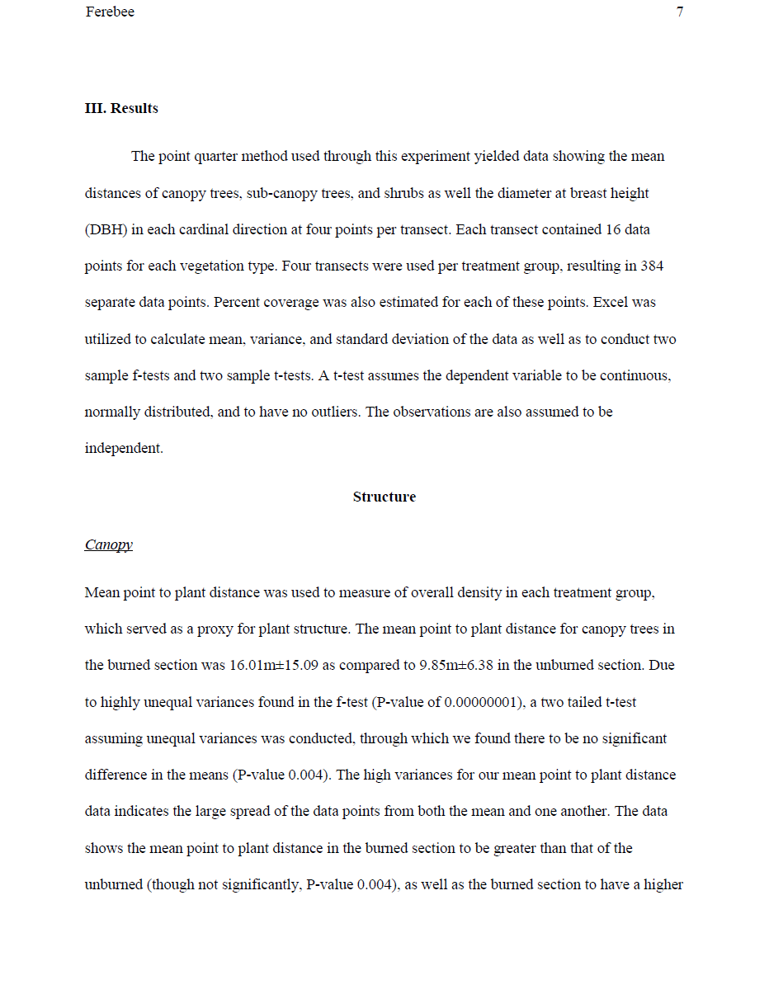
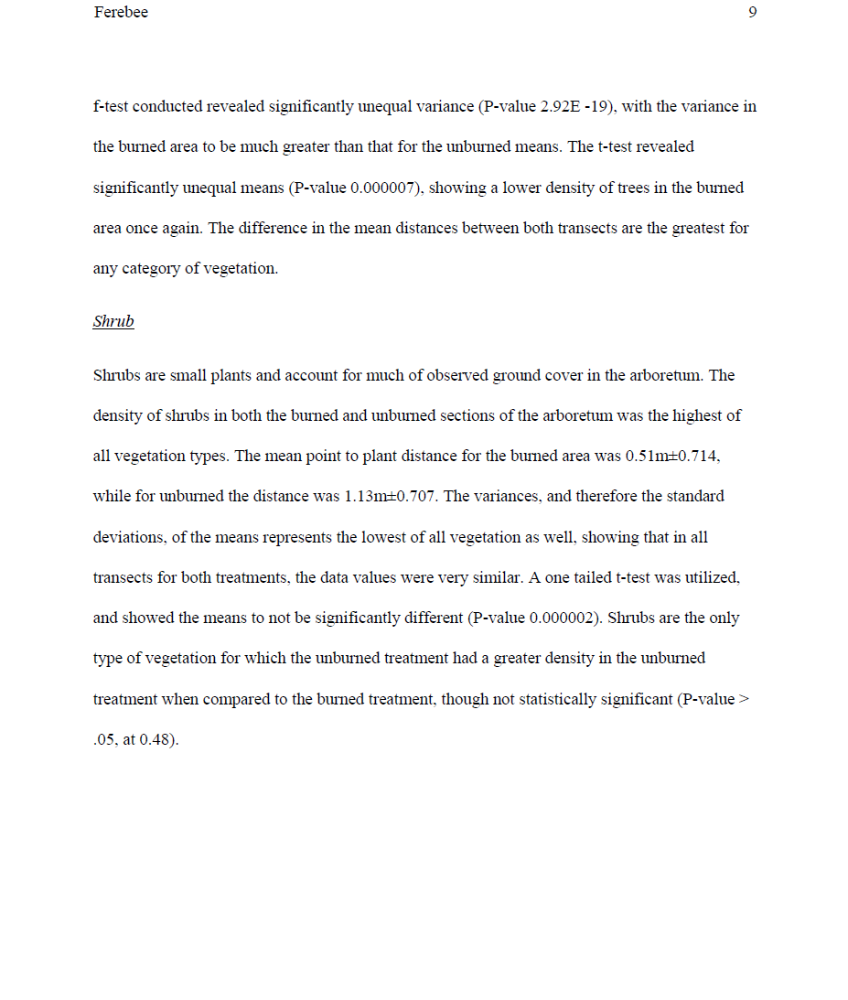
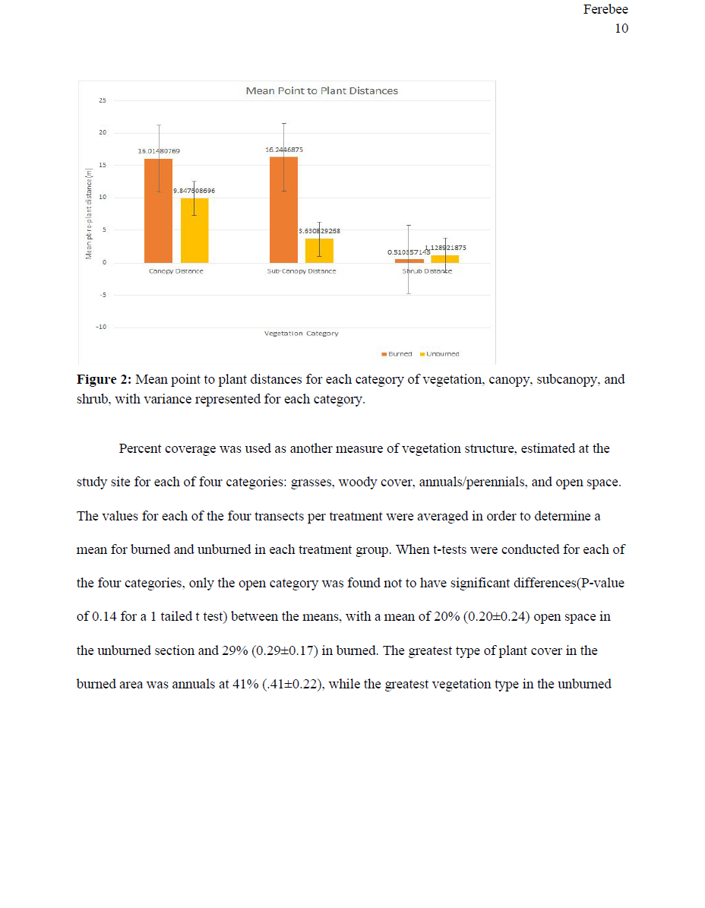
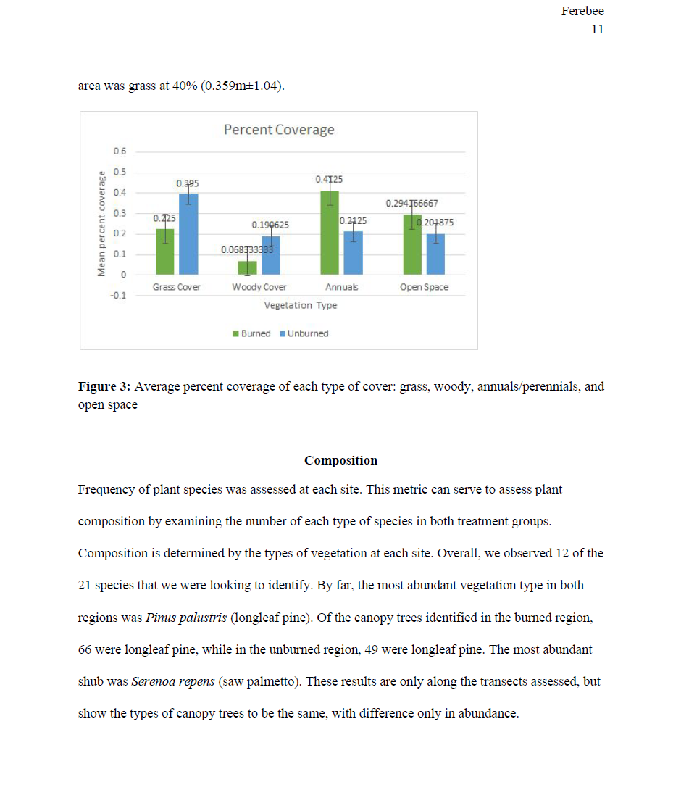

A site maintained by Biplabendu Das (Lab Instructor, PCB3044L-Spring2019, UCF-Biology)

<style>
body {text-align: justify}
</style>

```{r, echo=F}
library(htmltools)
library(vembedr)
```

<a id="headlines"></a>
----------------------------------

### Lab Materials

##### 1. [F-test and T-test Cheat Sheet](#1)
##### 2. [Plotting means and standard deviations in Excel](#2)
##### 3. [Example of a well-written Introduction-Results-Discussion](#3)

  

<a id="1"></a>
----------------------------------

#### F-test and T-test Cheat Sheet  


  
```{r, echo=F, out.width = '100%', fig.align='center', out.extra='style="background-color: #9ecff7; padding:10px; display: inline-block;"'}
knitr::include_graphics("images/cheatsheet-images/cheatsheet1.jpg")

knitr::include_graphics("images/cheatsheet-images/cheatsheet3.jpg")
knitr::include_graphics("images/cheatsheet-images/cheatsheet4.jpg")

```  
   
   
```{r, echo=F, out.width = '75%', fig.align='center'}
knitr::include_graphics("images/cheatsheet-images/cheatsheet6.jpg")
```

    
[Go to top](#headlines)      
   
----------------------------------


<a id="2"></a>
----------------------------------

#### Tutorial - Plotting means and standard deviations in Excel   

<iframe width="560" height="315" src="https://www.youtube.com/embed/3wo29oDkyG0" frameborder="0" allow="accelerometer; autoplay; encrypted-media; gyroscope; picture-in-picture" allowfullscreen></iframe>

   
[Go to top](#headlines)      
   
----------------------------------


<a id="3"></a>
----------------------------------

#### Example of a well-written Introduction-Results-Discussion

Please note, this document is meant for reference purposes only.   
DO NOT COPY.   
This document has already been submitted to the Turnitin repository, so any attempt to plagiarize will be detected upon submission and will not be tolerated under any circumstance. 
Submissions with above 20% plagiarism score will get an automatic zero.   


  
```{r, echo=F, out.width = '100%', fig.align='center', out.extra='style="background-color: #9ecff7; padding:10px; display: inline-block;"'}
knitr::include_graphics("images/Intro-Results-Discussion/image001.png")
knitr::include_graphics("images/Intro-Results-Discussion/image002.png")
knitr::include_graphics("images/Intro-Results-Discussion/image003.png")




knitr::include_graphics("images/Intro-Results-Discussion/image008.png")
knitr::include_graphics("images/Intro-Results-Discussion/image009.png")
knitr::include_graphics("images/Intro-Results-Discussion/image010.png")
knitr::include_graphics("images/Intro-Results-Discussion/image011.png")
knitr::include_graphics("images/Intro-Results-Discussion/image012.png")
```  
   
    
[Go to top](#headlines)      
   
----------------------------------
  
```{r}
# Check this space for more materials!
```

